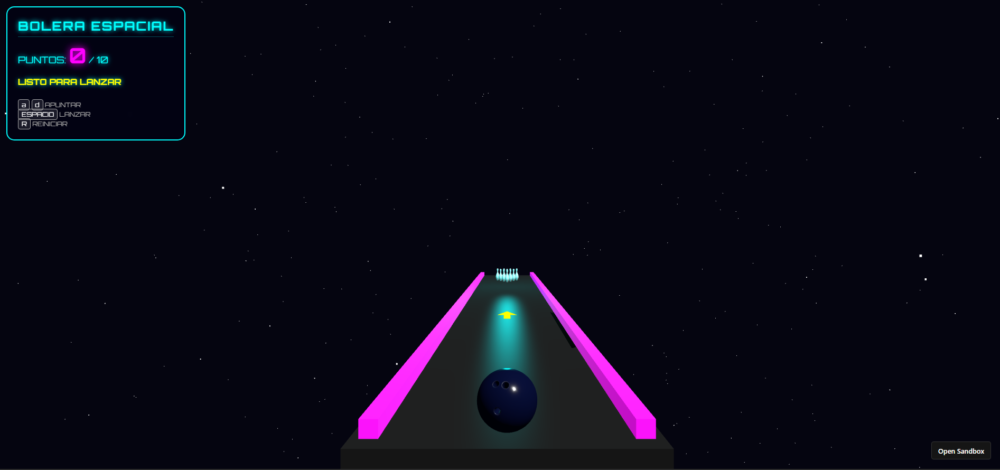

# AnimacionBolosIG

Este proyecto es una **simulación completa de bolos en 3D**, desarrollada con:

- **Three.js**: Renderizado 3D  
- **Ammo.js**: Física realista de colisiones y rigid bodies  
- **GLTFLoader**: Carga de modelos `.glb`  
- **Tween.js**: Animaciones suaves (cámara, efectos)  

El objetivo es recrear una **experiencia estilo Wii Sports** con:

- Bolos con físicas reales  
- Bola con masa e impulso direccional  
- Sonidos de strike, spare y fallo  
- Cámara cinemática  
- Flecha direccional animada  
- Colores y luces de estilo “neón espacial”

---

# Características principales

## 1. Carga automática de modelos GLB

El juego carga:

- `bowling_pin.glb`
- `bowling_ball.glb`

Ambos modelos se centran automáticamente usando **Box3**, se escalan según parámetros físicos y se incluyen dentro de un **wrapper** para evitar problemas de alineación o físicas.

## 2. Física real con Ammo.js

Cada objeto tiene:

- Cuerpo rígido (rigid body)
- Fricción
- Restitución (rebote)
- Inercia realista
- Colisiones precisas

## 3. Sistema de puntuación

Detecta si un bolo está:

- Caído (ángulo > 45°)
- Fuera del mapa
- De pie

Los bolos derribados se pintan en rojo.

Incluye sonidos para:

- Strike  
- Buen tiro  
- Mal tiro  
- Lanzamiento  

## 4. Cámara cinematográfica y efectos

Al lanzar la bola:

- La cámara se desliza hacia la pista  
- Se inclina  
- Tras un strike, la cámara realiza un efecto de rebote de celebración  

Todo gestionado con **Tween.js**.

## 5. Controles

| Tecla     | Acción                          |
|-----------|---------------------------------|
| A         | Girar el tiro a la izquierda    |
| D         | Girar el tiro a la derecha      |
| Espacio   | Lanzar la bola                  |
| R         | Reiniciar la partida            |

## 6. Flecha direccional animada

Dibujada con `THREE.Shape()`, rotada y recalculada en tiempo real según el ángulo de lanzamiento de la bola.

---

# Enlaces

## Enlace a video

---

# Autor

Jesús Santacruz Martín-Delgado  
[GitHub @jesussmd10](https://github.com/jesussmd10)

Trabajo universitario para la asignatura de Informática Gráfica.
